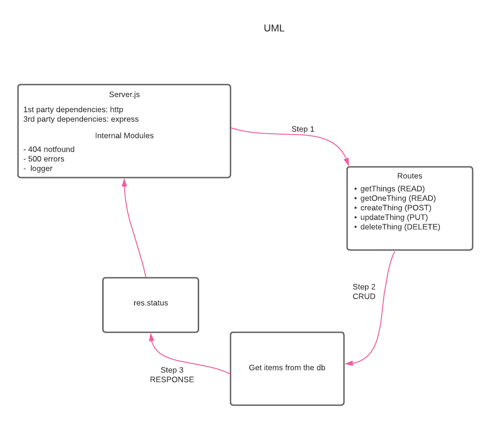

# 401 Basic API Server - Lab 03

## Project: Deployment test

## Author: Clement Buchanan

- Test Report:
-  Front-end: 

### Setup

- requirements
    - error handlers
    - middleware
    - PORT: 3333

### Running the App

- npm start
  - Endpoint: /things
  - Return Object from db
  - Return: 404 error

- 
- 

### Tests

- 404 on a bad route
- 404 on a bad method
- The correct status codes and returned data for each REST route
  - Create a record using POST
  - Read a list of records using GET
  - Read a record using GET
  - Update a record using PUT
  - Destroy a record using DELETE

#### UML

### Deployment

  - [Heroku deployment link]()